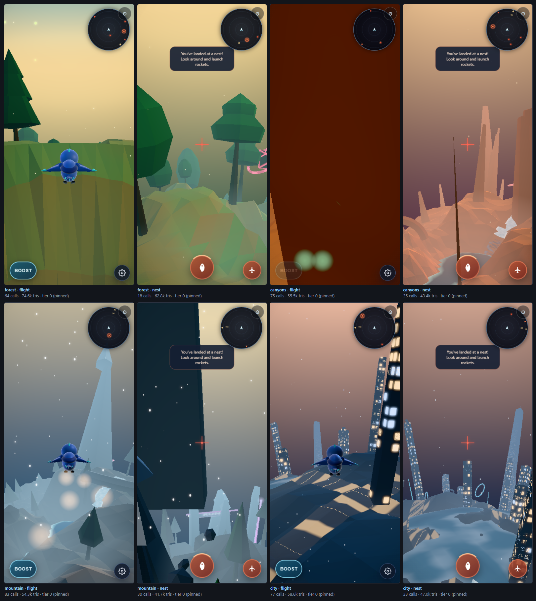

# Birb realism: research and executive decisions

Build a visually ambitious, physically believable version of Birb around a rebuilt bird, grounded landscapes and a consistent lighting model. First establish the best image in a small playable scene on the iPhone; then derive sustainable profiles from that image. Increasing every existing slider is a useful stress test, but it cannot supply the anatomy, surface structure or environmental relationships missing from the current art.

The primary acceptance device is **iPhone 16 Pro, Chrome 152.0.7977.64**, as reported by its owner. iOS version and live browser capabilities remain to be recorded. Root Birb remains mobile first. This document makes the art and architecture decisions; it does not certify device performance or implement the game changes.

## Decision record

| Decision | Direction for builders |
|---|---|
| Visual target | A believable blue bird in a natural miniature world, with deliberately readable arcade objectives. Preserve the blue/cyan identity; rebuild anatomy, feather structure, contacts and materials. |
| First production scene | A forest river valley: one excellent bird, a hero tree/perch, a waterfall/pool, a short canopy-to-water flight and a three-gate challenge. It must demonstrate the final ambition, rather than spread modest polish across four worlds. |
| Rebuild scope | Rebuild the bird asset/rig and the near-field terrain/material/prop layer. Extract rendering ownership and world-surface queries where these changes need stable interfaces. Preserve the proven flight, recovery, nesting and scoring contracts. |
| Renderer | Keep pinned Three.js 0.183.2/WebGL2 for the first realism slice. Run a separately budgeted WebGPU/TSL experiment after that slice supplies a real comparison. No engine-wide migration as a prerequisite. |
| Content production | Allow authored meshes and a small compressed texture set for root Birb. Retain procedural placement. Offline authoring/baking is allowed; the shipped site can remain static with no runtime build framework. This does not amend the independent zero-asset rules of `/sculpture`. |
| Lighting | One coherent sun/sky/environment-light model, linear composition and one final output transform. Correct spatial shadows and material response before increasing bloom or adding more lights. |
| Quality | Separate art direction, resource quality and comfort settings. Derive named profiles from measured image/cost tradeoffs. A profile is versioned data plus a validation record, not a marketing label. |
| Maximum mode | An opt-in, time-bounded **Reference Lab** can exceed historic scene budgets. It must remain recoverable and visibly experimental. A subsequent device-qualified profile earns the default. |
| Gameplay and world | Keep the radius-120 spherical gameplay domain in the first slice. Increase apparent scale through hierarchy, coherent landmarks and distant scenery. Reconsider radius only in a separate flight-design experiment. |
| Release sequence | Minimal observability repairs → ambitious vertical slice → phone profile experiments → controller implementation → four-biome rollout. Research approval is complete; device certification is a build acceptance gate. |

Companion documents: [profiles and validation](PROFILES.md), [ordered build backlog](BUILD_BACKLOG.md), [the tiered agent execution plan](../ULTRACODE_REALISM_PLAN.md), [the authored-asset contract](AUTHORED_ASSETS.md) and [its job queue](ASSET_JOBS.md), and [proposed machine-readable profiles](profiles.proposed.json). The JSON is a specification for builders, **not a preset file the current game can import**.

## Reviewed baseline and evidence

The review checkout was fetched and fast-forwarded from the old September 9 checkout to remote main **[`f3f7c171e1ade34057c89929f8193ca600431815`](https://github.com/Mentis123/birb/tree/f3f7c171e1ade34057c89929f8193ca600431815)**. The final handoff record records any later sync. Changes in this package are documentation and evidence only.

The review covers root `index.html`, its flight/pose, world, water, atmosphere, shadows, quality and telemetry paths; the performance contract and gate history; recent visual plans; and the root capture/mode harnesses. Sibling applications such as Humanoid, Bronze and Grok Rogue are outside the implementation scope. GitHub issue search returned no issue records; PR discussions around valley water, slalom and the rocket freeze supplied historical context, not proof of today's runtime state.

| Recent main change | What it establishes | Consequence for the next build |
|---|---|---|
| `a77fb36` and preceding workbench waves | Manual/Benchmark control routing, live readback, seed streams, capture/evidence machinery and workbench UI. | Extend this infrastructure; do not commission another diagnostics panel. |
| `ca6333f`, Wave 3A re-gate | Policy fixtures and oracles progressed to an implementable specification. | This is not a shipped replacement controller. `src/game/adaptive-quality.js` remains absent. |
| `c242f76`, `f1d611f`, `1ae2e66` | Above-baseline DPR/post options, dynamic shadows, scene-target MSAA, anisotropy and terrain mesh presets. | These are useful experiments. Their enum ceilings do not establish best image quality. |
| `6112544` | Per-biome grade infrastructure and candidate sheets. | The candidate evidence predates the next rendering fix. Regenerate it before using it to choose a grade. |
| `e724235` | Final composite now applies tone mapping to the offscreen scene path. | Preserve this correction. Rebaseline direct/post parity and exposure before judging materials. |
| `f3f7c17` | Workbench button and reduced panel obstruction. | Use the existing access route when doing phone trials. |

**Observed, not inferred from code:** the existing eight-view contact-sheet harness completed with exit 0. Its full-quality pinned scenes ranged from 18–83 reported scene draw calls and 41,682–74,614 scene triangles in these particular views. These numbers are view-dependent and exclude some additional rendering work; they are not phone limits. See [contact sheet](evidence/contact-sheet.png).

A second browser run used seed `16160`, four biomes, a 390×844 CSS viewport and emulated DPR 1. It reported matching requested/serving build labels `v46-2026-09-10-ultra-panel`, five render passes on the sampled frames, half-resolution post, MSAA off, dynamic shadows off and no captured page/console warning/error. Raw snapshots are in [observations.json](evidence/observations.json). This was Windows Chromium with a mobile viewport, **not Chrome on iPhone**. It is composition evidence, not a controlled moving-image A/B or a sustained performance result. The 1× captures also cannot certify fine detail at the phone's actual render resolution.

The frames show a recognisable blue bird and distinct biome palettes. They also show a consistent ceiling: rounded component-based bird anatomy, solid polygonal tree crowns, broad terrain facets, narrow spike-like mountains and luminous window grids on simple city towers. More subtle features may exist in other views; these are observations of the saved frames, not claims that unseen features never render.

The canyon flight tile is almost entirely occupied by foreground geometry. The mountain perch tile also has a large foreground obstruction. The harness nevertheless succeeds. These captures demonstrate that a nonblank frame and healthy game systems are insufficient visual acceptance criteria. The root cause may involve pose/camera clearance or procedural placement; it has not been isolated here. Add dedicated reproduction views before declaring a gameplay regression.

Local baseline: `node --test --test-isolation=none` completed with **633 tests: 423 passed, 210 skipped, 0 failed**. The skip count is material: future adaptive/learning implementation tests are among the skipped work. The official mode harness was attempted twice and timed out at its 5-second startup-button click, before exercising the modes. It is inconclusive in this environment, not a passing mode result or an established game regression. See [the handoff record](HANDOFF.md). No physical iPhone run, phone heat measurement, long-run battery measurement or finger-to-display latency measurement was performed in this review.

## Findings that should change the build order

### The next fidelity jump is in representation

The terrain and most props use flat-shaded Lambert materials. The bird already uses Standard materials, but its constructor in [`index.html` around line 6595](https://github.com/Mentis123/birb/blob/f3f7c171e1ade34057c89929f8193ca600431815/index.html#L6595) assembles spheres/cones and a few feather plates. Its pose system already has burst flapping, an asymmetric stroke and perch folding. Adding those again would duplicate completed work; richer joints, feather overlap and contact are the new work.

No root `scene.environment`/PMREM assignment was found in the reviewed rendering path. Adding a suitable environment-light representation should be tested before expensive material effects. A material can contain sophisticated parameters and still have little believable world information to reflect.

Texture anisotropic filtering and an anisotropic feather highlight are different techniques. The current workbench filtering slider affects existing sampled textures; it cannot add feather structure or sharpen procedural ground noise. The bird's proposed directional reflectance is a separate material experiment.

The current mobile ground presets contain 15,904, 32,960 and 56,160 triangles. The higher presets resample the same terrain field. They can improve contour sampling, but do not invent geology, river banks, erosion, or an appropriate surface-frequency hierarchy. The upgrade should therefore author the terrain field and its materials alongside geometry, rather than treat tessellation as the realism project.

### Some diagnostic labels are more ambitious than their semantics

The previous G-ASCEND reset defects are repaired in current source: reset uses the shipping bloom strength and PCF default. The above-one decorative-density promise was removed from the MAX action. Do not re-open those historical failures as if the fixes were absent.

There are still useful follow-ups:

| Finding at reviewed main | Decision |
|---|---|
| `decorativeDensity` largely controls wind amplitude plus binary contact/ribbon gates; it is not a general population budget. Its effective readback uses the wind uniform, whose per-frame mapping differs from the requested slider value. | Split into honest controls: wind response is art/comfort; particle count, nearby clutter population and draw-range are resource controls. Preserve old keys through a migration adapter if necessary. |
| `targetRate` reports fixed 60 and `surfaceDetail` fixed baseline in `panelGetControlState()`. | 30 FPS pacing and richer material/detail variants must be implemented before profiles can claim them. |
| `estimateBloomTargetMb()` counts color storage but omits depth and the new shadow allocations. | Rename the current value to its actual scope, then add a resource ledger with format/sample/size provenance. Never call it total GPU memory. |
| The shadow proxy is a common six-sided, 20-unit cone placed at each nest entry, rather than the actual support's base, dimensions and silhouette. | Treat existing shadows as an experimental approximation. Replace proxy authoring before making shadow fidelity a selling point. Inspect city-tower and tree shadows side by side. |
| Scene MSAA lives in the bloom pass's scene render target. | Separate the scene/output path from optional bloom so an inexpensive post profile can retain AA. Report configured samples separately from whether the last frame traversed that target. |
| The grade sheets were committed before the tone-map correction; G-GRADE explains why some earlier comparisons did not measure their advertised change. | Retain historical gate reports, add a clear supersession notice, regenerate frozen comparisons and select a fresh baseline. |
| `quality()` still exposes unavailable cooldown/reason fields; the new controller module is absent. | Ship the manual realism slice while completing controller prerequisites. Do not describe Auto as a proven multidimensional optimizer. |

Source anchors: [quality routing](https://github.com/Mentis123/birb/blob/f3f7c171e1ade34057c89929f8193ca600431815/index.html#L7229), [shadow proxies](https://github.com/Mentis123/birb/blob/f3f7c171e1ade34057c89929f8193ca600431815/index.html#L5756), [control readback](https://github.com/Mentis123/birb/blob/f3f7c171e1ade34057c89929f8193ca600431815/index.html#L8478), [memory estimator](https://github.com/Mentis123/birb/blob/f3f7c171e1ade34057c89929f8193ca600431815/index.html#L8576), [reset](https://github.com/Mentis123/birb/blob/f3f7c171e1ade34057c89929f8193ca600431815/index.html#L8699).

## Research gems and their practical use

The references below are original technical publications, engine documentation or accounts from the teams that built the systems. Historical console/desktop results establish techniques, not iPhone cost estimates. Current Three documentation may describe APIs newer than 0.183.2; builders must check the pinned implementation before using an option.

| Research finding | Birb decision and limitation |
|---|---|
| Sucker Punch connected wind and world data to many visual systems, and replaced many ambient emitters with a camera-following system informed by biome data. [S1] | Add a small common environment field and use it consistently. Adopt the relationships, not the game's particle counts or engine architecture. |
| Stanford's observations of bird flight document changing wing shape, twist and asymmetry; separate work examines head stabilization and landing forces. [S2–S4] | Rebuild wing articulation and landing performance around visible motion cues. Keep arcade physics. These studies cover particular species and do not supply a universal animation curve. |
| Disney's fur LOD work uses projected pixel width to guide detail transitions. [S5] | Make feather-detail decisions from screen size: retain silhouette feathers, merge subpixel feather detail into shading. Do not attempt a film-strand renderer on the phone. |
| Three provides environment-map prefiltering, including generation from a scene; Physical materials add per-pixel cost as features are enabled. [S6–S8] | Use a procedural outdoor lighting capture or a compact authored sky. Test one restrained feather sheen/anisotropic highlight variant on the bird; avoid Physical material on every prop. |
| Filament explicitly handles specular aliasing, and SMAA addresses edge reconstruction with several quality strategies. [S9–S10] | Measure motion sparkle and thin silhouettes separately. MSAA cannot be assumed to fix procedural-shader or specular aliasing. Keep a non-temporal AA fallback; gate any TAA experiment on disocclusion tests. |
| Valve's water-flow work uses directional flow information to avoid uniform scrolling and route water around obstacles. [S11] | Derive a flow field from Birb's river centreline/obstacles, and use it for normals and foam. It is an excellent local-water experiment, without requiring fluid simulation. |
| Geometry clipmaps put detail near the viewer and smoothly transition across resolutions. [S12] | Prototype a shared coarse sphere plus a bounded near-field terrain patch/LOD system. Adapt seams and coordinates to a sphere; a planar clipmap cannot simply be pasted onto this world. |
| Bruneton supplies a documented atmospheric model, including a WebGL2 demo and validation. [S13] | Use it as a sky/atmosphere reference and a later LUT experiment. Its Earth-scale assumptions are not Birb's radius-120 world. Calibrate a separate visual scale. |
| Local cubemap research explains parallax errors and geometry-proxy correction. [S14] | Test one local reflection probe at the hero pool. On the cheaper profiles use the same lighting color with simpler reflection; no full-world reflection capture every frame. |
| WebGL guidance emphasizes avoiding stalls, accounting for VRAM, smaller buffers, batching and compressed textures. Timer queries require delayed reads and disjoint handling. [S15–S16] | Track real allocations and complete-frame work; keep unavailable timings explicit. Apply diagnostics sparingly during phone performance runs. |
| Safari 26 introduced WebGPU; Three's WebGPURenderer has different shader/post-processing architecture and does not directly support existing ShaderMaterial/onBeforeCompile customizations. [S17–S18] | WebGPU is a serious experimental option. It is not a one-line switch for Birb's many GLSL injections, nor proof that this owner's Chrome installation exposes it. |
| Apple's gaming material distinguishes sustained performance from launch performance. Newer Metal diagnostics contextualize long traces with game state. [S19–S20] | Test a full warm session with route and quality markers. Those native entitlements/APIs are not automatically available to a web page. |

## The bird: rebuild the hero

**Approved direction:** a bluebird-like small passerine as the anatomical base, with Birb's blue/cyan fantasy identity. Use one coherent species reference family for proportions, wing overlap and feet. Avoid combining an eagle's wings, a parrot's beak and a toy's body merely because each is individually recognisable. Preserve character through eyes, color blocking, pose and response.

The first model should have a continuous body/neck/head silhouette, a shaped beak with a readable upper/lower seam, eyelids around glossy eyes, a tail fan and layered primaries, secondaries and coverts. Model the larger silhouette feathers; represent the fine body feathering through directional normal/roughness information and limited surface relief. At chase distance, a convincing shoulder-to-wing transition matters more than tiny feather barbs.

Use an authored lightweight rig: shoulder, elbow, wrist, primary fan and tail controls, plus head and feet. Retain the existing burst timing and add fold/twist during recovery, subtle asymmetric correction during bank, controlled head stabilization, tail fan during braking, feet extension before touchdown and a small body compression when gripping a perch. Foot placement needs a contact solve against the actual perch frame. This is visual animation driven by the existing flight state, not a new aerodynamic simulation. Stanford's research motivates these observable cues; the exact rig and game mapping are design decisions. [S2–S4]

Start with three geometry LODs, provisionally 25–40k / 8–12k / 3–5k triangles and a target of roughly 3–5 material draws per hero instance. These are authoring experiments, not phone budgets or reasons to add unnecessary polygons. LOD selection must protect the visible wing outline and eye/beak identity. Feather cards, if used, need opaque or alpha-tested majority coverage, stable mips and a tested AA path. Stacked blended cards can become a fill-rate trap. Three's alpha-to-coverage and double-sided transparency behavior must be checked against the actual offscreen-MSAA path; API labels alone do not establish correct coverage. [S5, S21]

Create a neutral bird inspection scene and a six-angle turntable, but accept it in the actual chase, bank and perch cameras. Required clips: 10 seconds each of cruise, climb burst, hard bank, boost, braking, landing, perched idle and takeoff. Look for intersecting feathers, disappearing trailing edges, rigid feet, skating contacts and highlight sparkle. Keep the existing procedural bird as a quick fallback and a regression comparator until the rebuild passes.

## Terrain, vegetation, objects and map

**Approved terrain direction:** believable forms at three scales. Macro structure gives each biome a drainage basin, ridge/valley logic and readable routes. Medium structure supplies ledges, exposed roots, rock fractures, eroded banks and talus. Fine structure is filtered material detail. Random noise is a variation tool, not the organizing principle of all three scales.

Use a stable surface-query interface returning height, normal, biome/material weights, wetness, water height/flow and a surface identifier. Terrain placement, water, vegetation and contact effects should read the same data. Keep the existing carve-down/floor invariant in the first slice; visual geometry changes must not silently put solid ground above the controller's valid flight floor. Overhangs, roots and hero rock shelves need explicit collision proxies and camera-clearance checks.

Create smooth terrain shading with authored hard breaks where rock faces need them. Blend a small rock/soil/vegetation or snow material set by slope, height, deposition/wetness and low-frequency variation. Use normal/roughness detail with mipmaps and distance-dependent amplitude; do not add many unfiltered noise octaves to every pixel. Triplanar mapping is useful for exposed rock but multiplies texture sampling, so compare it with UV/local projection on the hero patch. A surface-detail profile should change sampling cost while retaining the broad material boundaries.

Near-field terrain should receive the costly contours and surface detail. Keep a coarse sphere for the far field; prototype reusable local patches or a small stitched spherical LOD layout where screen error warrants it. Require crack-free joins, stable normals, pole traversal, shadow continuity and matching water contacts. Reuse grids and precompute buffers. Do not regenerate large geometry in the active frame loop. Clipmap research supplies a useful pattern, but this spherical adaptation needs its own proof. [S12]

**Vegetation rebuild:** replace the nearest solid crown shapes with branching silhouettes, grouped leaf masses and a few gaps through which light is visible. Use several authored variations and deterministic clustering around surface conditions. Fewer well-composed trees can be more convincing than twice as many identical trees. Keep cheap aggregate forms in the distance. Select LOD from projected size with hysteresis; test orbit transitions against sky, not only in a busy forest.

A common wind field should move trunks slowly, branches with lag and leaves with small faster motion. The same gust direction should influence feathers, falling debris and mist. Near a low-flying bird, use one bounded local disturbance field for foliage and loose material. The recommendation is a compact analytic field with a small fixed event pool, not an individual physics object for each leaf. [S1]

**Object placement must have a reason.** Roots meet soil; rocks share geology with the slope; debris gathers in sheltered areas; snow accumulates on upward-facing surfaces; wetness darkens the bank nearest the river. Champion perches need bespoke support geometry, a visible gripping surface and a camera-clear approach. Preserve slalom gate centers and gameplay collision contracts while rebuilding their visual shell.

| Biome | Hero identity | Specific rebuild | Must remain readable |
|---|---|---|---|
| Forest | Layered canopy and a cool river under warmer sunlight | Branching hero tree, bark/roots, leaf litter, wet stones, a coherent stream-to-pool waterfall | Open flight lanes, readable nests, silhouettes against foliage |
| Canyons | Sedimentary mass, weathered ledges and a continuous river | Replace needle/flat-wall repetition with varied buttresses, talus, arches with grounded legs, eroded banks | Arch openings, low-pass clearances and slalom entry direction |
| Mountain | A connected ridge system with snow accumulation | Broad peaks with smaller fractures; slope/deposition snow masks, scree, exposed rock, local spindrift | Ridge boundaries in pale weather; no snow veil hiding gates |
| City | A plausible inhabited settlement on the miniature planet | Buildings with base/middle/roof hierarchy, setbacks, consistent floor scale, balconies/roof equipment, selected glass and rough masonry | Rooftop perches, target separation, roads that fit the terrain |

The map should become a authored route graph over the existing sphere: sheltered takeoff, open vista, landmark approach, low pass, challenge and recovery space. Build the three-gate vertical-slice loop first, then one signature route per biome. The current small globe creates strong curvature and exaggerated height relationships. Use distant noninteractive silhouettes and haze to enrich views before changing the physical radius. A radius increase would alter flight time, landing, collisions, slalom spacing and camera horizons simultaneously; isolate and measure that as a separate product decision.

Do not revive the previously rejected uniform spatial-sector batching scheme. Its draw-call penalty has actual repository evidence. Reopen spatial culling only when the new clustered content distribution changes the premise, and compare whole-frame time, shadow submissions, visibility and memory against the existing instancing. Screen-space LOD and fewer material variants are the first levers.

## Lighting, water and atmosphere

Keep the repaired linear post pipeline. The scene and bloom should combine in linear space, followed by a single tone/output conversion. Add a neutral color/material chart scene and compare the direct and post paths with bloom/shafts disabled. The meaningful acceptance is material consistency and absence of double/missing transforms, rather than matching a historical frame produced by a broken pipeline. [S22]

**Initial art choice:** retain Neutral as the comparison baseline. Build the forest reference under a coherent moderately warm sun and cooler sky fill, with enough shadow detail to navigate. Use overcast/cooler mountain light, warm canyon rock under more neutral illumination, and a city blue-hour rig. These are selected directions, not approved numerical exposure values. Lock final values only after a fresh post-fix chart, matched shots and the primary phone review. Remove the assumption that a warmer grade alone creates realism.

Generate a compact outdoor environment light at load/biome entry or at infrequent lighting keyframes; use the same sky/sun state that the player sees. PMREM can prefilter an authored or procedural environment for roughness-dependent reflections. It should not capture the whole moving world every frame. Start with a small probe and increase resolution only if reflected structure benefits visibly. [S6–S8]

For direct shadows, replace the generic cone proxies with base-anchored proxies shaped for the actual tree, rock or tower, and allow accurate hero casters nearby. Use a stable, fitted near shadow region; test sun-aligned motion and shadow texel snapping. Begin with PCF, 1024/2048 experiments, and appropriate bias for world scale. VSM may produce useful softness but is not intrinsically the best setting: inspect light leakage and small contacts before selecting it. A second cascade is a later experiment if a single near region visibly fails; do not add it by default. Shadow partitioning literature is informative, but its hardware/performance claims do not transfer to this phone. [S23]

Separate sky atmosphere from local haze. Retain a cheap atmospheric baseline and improve its relation to light and terrain height. In Reference Lab, compare a compact atmosphere LUT and a depth-aware local fog bank against it. Prevent fog from flattening the bird, target or whole foreground. True volumetric clouds or full-scene ray-marched fog are later experiments, after cheaper cues have been exhausted. Bruneton's dimensional treatment is especially useful here: the apparent atmospheric scale need not equal a 120-unit gameplay planet. [S13]

**Water priority is contact and flow.** The terrain carve, water height and bank geometry must agree. Then add directional two-phase normal flow, bank/obstacle foam, a darker wet margin and restrained depth color. Use the river's path to steer flow around turns, and prevent foam from sliding sideways across the bank. A stylized analytic reflection remains an acceptable cheaper representation if it shares the sky's light/color. [S11]

At the hero pool, compare a cached local reflection probe with one bounded planar reflection. A planar reflection only applies to a sufficiently flat local patch, not the whole spherical water surface. Budget the additional world render, culling, update cadence and storage. Inspect parallax, edge seams and reflections that lag during flight. Prefer the cheaper result unless the reflection earns its cost in the actual route. [S14]

The waterfall should visibly attach to its lip, break at impact, produce locally bounded mist, and feed the pool/river. Layer opaque/alpha-tested structure with a small amount of soft spray. It should remain convincing with most spray removed. A bloom halo or a stack of translucent sheets must not be the only evidence of falling water.

## Feel, effects and mini-games

The bird should seem to disturb the space it moves through. Author a small set of shared events: wingbeat near loose leaves, bank gust near canopy, surface skim, perch contact, rocket launch and material-specific impact. Each event has a location, surface type, direction, magnitude and short lifetime. Renderers/audio consume it through bounded pools. This is an original architecture recommendation informed by the environment-coupling research, rather than a request for a general simulation framework.

Keep speed cues proportional to movement and confined to appropriate screen regions. Default to crisp central vision. Motion blur, depth of field, lens dirt, chromatic aberration, heavy vignette and film grain are not prerequisites for realism; make camera comfort independent of compute quality. A high-fidelity, reduced-motion profile must be possible. Wingtip ribbons should communicate boost/bank briefly without reading as permanent neon appendages.

For drones and rockets, preserve existing gameplay and improve mechanical credibility: articulated rotor/guard silhouettes, materials that distinguish painted metal from emissive lenses, launch impulse, short muzzle exhaust and a coherent impact sequence. Put damage cues on the target and immediate surroundings before filling the full frame. Preserve pooled entities and the existing collision grid. Historical PR [#406](https://github.com/Mentis123/birb/pull/406) demonstrates why render detail must not silently join the per-rocket recursive raycast set.

Sound deserves its own slice: speed-based air, short feather/wing transients, distinct perch materials, waterfall attenuation, drone direction and a launch/impact contrast. First audit the working HTML Audio pool and device behavior. `CLAUDE.md`'s blanket statement that Web Audio does not work on iOS is too broad: the platform has user-activation and interruption/resume behavior that must be handled. A bounded Web Audio spatial-effects experiment is reasonable, with the existing playback fallback retained until phone testing succeeds. WebAudio's interrupted state is documented; a native haptic feature or a web vibration call must not be promised as universally available on the target. [S24–S25]

Mini-games should reveal the environment's best moments:

| Experience | Direction | Acceptance |
|---|---|---|
| Casual/Zen | Quiet observation perches and a low-HUD exploration route; no constant decorative spawning requirement | A 30-second view remains alive through light, wind, subtle behavior and sound |
| Slalom/flight challenge | Use natural clearances and a few legible gates; add an optional deterministic ghost/replay later | Entire route fits the actual bird and chase camera; cues visible before the turn |
| Ring Rush | Compose routes around a waterfall skim, arch or rooftop transition; keep collection count and timing independent of quality | Identical reachable objectives, collision and scoring in every profile |
| Drone Hunter | Encounters staged where silhouettes and audio separate targets from scenery | Fair visibility at lower detail; no hiding enemies behind removed foliage |
| Turret Defense | Perches with useful sightlines and materially distinct launch/impact feedback | All waves/fire paths work after every environment and profile change |

Do not make fog, visual noise or omitted props a difficulty modifier. Gameplay-bearing objects, audio cues, contacts and route markers survive every performance profile. Test the root harness's exact supported mode IDs rather than assuming a displayed challenge name is already a separate mode.

## Rebuild and technology boundaries

Extract only the seams needed for ownership: `RenderPipeline` owns scene targets/output/AA; `QualityRuntime` resolves profile requests and transitions; `WorldSurface` supplies consistent queries; the bird owns its rig/material/LOD; `EnvironmentField` supplies shared wind/wetness/flow. These are proposed responsibilities, not mandatory class names. Keep arrays and buffers preallocated in active updates and keep DOM telemetry on a slower cadence.

Maintain one authoritative scene and gameplay state. Do not keep two complete worlds alive merely to switch visual quality instantly. Prewarm a bounded set of variants and queue structural changes at a safe transition. Give every new target, material variant, texture and geometry an explicit owner/disposal path. The compressed texture loader/transcoder and any decoder are part of download and initialization cost, not free tooling. [S15, S26]

**WebGPU experiment:** implement the bird plus one terrain/material sample and the same output path using TSL; compare visual parity, initialization, sustained frame delivery and memory on the primary phone. Feature-detect adapter acquisition and limits over HTTPS. Preserve the WebGL route as a fallback. The new renderer's fallback backend does not automatically translate Birb's existing custom GLSL injection stack. Proceed to migration only if measured benefit covers the porting/maintenance cost and important shaders retain parity. [S17–S18]

Do not adopt path tracing, real-time GI, a deferred many-light renderer, full fluid simulation, strand feathers, or a complete native engine rewrite for the first slice. They can be revisited with a concrete visual deficit and a bounded experiment. A native Metal build offers capabilities and diagnostics beyond a web page, but brings a separate app, deployment and parity burden. The current research does not establish that such a rewrite is needed.

## Evidence standard and unresolved questions

No numeric profile in this package is device-qualified. The existing 80k-triangle/100-draw guideline is useful historical context, but cannot be the sole acceptance criterion for a new rendering architecture. Reference Lab may exceed it; every exception must report complete-frame workload, image benefit and sustained device behavior. Neither a higher count nor a lower count alone determines whether the change is good.

The remaining uncertainties are specific: iOS version and actual Chrome capabilities; supported RGBA16F MSAA sample counts; whether GPU timing is exposed; stable 30/60 rendering cadence; comfort and battery behavior after warming; how much high-resolution feather/terrain detail survives the real chase view; and whether WebGPU improves this actual workload. They are addressed by [the phone protocol](PROFILES.md), rather than deferred as vague future optimization.

## Sources

Research accessed 10 September 2026. Dates below are publication/session dates where available; undated engine/API pages are live documentation. Recommendations and starting budgets in this package are engineering judgments, not source benchmark claims. No console or desktop benchmark is presented as iPhone performance.

1. **S1** — Matt Vainio, Sucker Punch, [How stunning visual effects bring Ghost of Tsushima to life](https://blog.playstation.com/?p=345372), 12 January 2021. Shared wind, world data, biome-aware ambient systems and interactive effects.
2. **S2** — Taylor Kubota / Stanford, [New method for recording bird flight in 3D](https://news.stanford.edu/stories/2017/04/new-method-recording-bird-flight-3d), 10 April 2017. Wing shape/twist/asymmetry observations.
3. **S3** — Stanford, [Steady drone cameras in swans](https://news.stanford.edu/stories/2015/08/birds-head-suspension-082815), 2015. Flight head stabilization.
4. **S4** — Stanford, [Drag can lift birds to new heights](https://news.stanford.edu/stories/2019/11/drag-can-lift-birds-new-heights), 25 November 2019. Species-specific takeoff/landing research.
5. **S5** — Walt Disney Animation Studios, [Artist Friendly Level-of-Detail in a Fur-filled World](https://media.disneyanimation.com/uploads/production/publication_asset/137/asset/lod_paper.pdf), 2016. Projected-detail LOD; offline production, not a mobile renderer.
6. **S6** — Three.js, [PMREMGenerator](https://threejs.org/docs/pages/PMREMGenerator.html), live documentation. Environment prefiltering and scene generation; verify against r183.
7. **S7** — Three.js, [MeshStandardMaterial](https://threejs.org/docs/pages/MeshStandardMaterial.html), live documentation. Baseline PBR material capabilities.
8. **S8** — Three.js, [MeshPhysicalMaterial](https://threejs.org/docs/pages/MeshPhysicalMaterial.html), live documentation. Sheen/anisotropy and feature cost; no proposal depends on newer retroreflection APIs.
9. **S9** — Google Filament, [Material definitions](https://google.github.io/filament/Materials.md.html), live documentation. Specular anti-aliasing and roughness controls; conceptual reference for a Three implementation.
10. **S10** — Jorge Jimenez et al., [SMAA: Enhanced Subpixel Morphological Antialiasing](https://www.iryoku.com/smaa/), Eurographics 2012. Edge reconstruction and quality variants; historical desktop timings are inapplicable to phone budgets.
11. **S11** — Alex Vlachos, Valve, [Water Flow in Portal 2](https://cdn.fastly.steamstatic.com/apps/valve/2010/siggraph2010_vlachos_waterflow.pdf), SIGGRAPH 2010, especially goals and flow-map construction. Directional water detail.
12. **S12** — Arul Asirvatham and Hugues Hoppe, [Terrain Rendering Using GPU-Based Geometry Clipmaps](https://developer.nvidia.com/gpugems/gpugems2/part-i-geometric-complexity/chapter-2-terrain-rendering-using-gpu-based-geometry), GPU Gems 2, 2005. Near-view regular grids and transitions; requires spherical adaptation.
13. **S13** — Eric Bruneton, [Precomputed Atmospheric Scattering: a New Implementation](https://ebruneton.github.io/precomputed_atmospheric_scattering/), 2017. Documented atmosphere model, units, validation and WebGL2 example.
14. **S14** — Sébastien Lagarde, [Image-based Lighting approaches and parallax-corrected cubemap](https://seblagarde.wordpress.com/2012/09/29/image-based-lighting-approaches-and-parallax-corrected-cubemap/), 29 September 2012. Reflection approximation and limitations.
15. **S15** — MDN, [WebGL best practices](https://developer.mozilla.org/en-US/docs/Web/API/WebGL_API/WebGL_best_practices), live documentation. Resource/stall/texture practices; no portable GPU-memory-limit query.
16. **S16** — Khronos, [EXT_disjoint_timer_query_webgl2](https://registry.khronos.org/webgl/extensions/EXT_disjoint_timer_query_webgl2/), revision 4, 1 June 2023. Delayed query reads and invalid/disjoint samples.
17. **S17** — WebKit, [WebKit Features in Safari 26.0](https://webkit.org/blog/17333/webkit-features-in-safari-26-0/), 2025. WebGPU release support; not confirmation of the owner's Chrome/iOS configuration.
18. **S18** — Three.js, [WebGPURenderer migration guide](https://threejs.org/manual/en/webgpurenderer), live indexed documentation. Shader and post migration constraints. Search-index contents were accessible; direct fetch returned 404 during this review, so the pinned source is the implementation authority.
19. **S19** — Apple, [Level up your games](https://developer.apple.com/videos/play/wwdc2025/209/), WWDC25. Sustained Execution Mode and energy context; native-game capabilities, not web APIs.
20. **S20** — Apple, [Find and fix performance issues in your Metal games](https://developer.apple.com/videos/play/wwdc2026/388/), WWDC26. Long-session trace context; verify OS/tool availability before use.
21. **S21** — Three.js, [Material](https://threejs.org/docs/pages/Material.html), live documentation. Alpha coverage, shadow sides and double-sided transparent draws.
22. **S22** — Three.js, [Color Management](https://threejs.org/manual/en/color-management.html) and [Post Processing](https://threejs.org/manual/en/post-processing.html), live indexed documentation. Linear workflow and final output transforms. Color-management direct fetch failed; indexed contents and the repo's repaired shader independently support the recommendation.
23. **S23** — Andrew Lauritzen, Marco Salvi and Aaron Lefohn, Intel, [Sample Distribution Shadow Maps](https://www.intel.com/content/www/us/en/developer/articles/technical/sample-distribution-shadow-maps.html), SIGGRAPH 2010 / updated 2012. Shadow partitioning research, not a proposed drop-in mobile implementation.
24. **S24** — MDN, [BaseAudioContext: state](https://developer.mozilla.org/en-US/docs/Web/API/BaseAudioContext/state), live documentation. Audio suspension/interruption lifecycle.
25. **S25** — MDN, [Vibration API](https://developer.mozilla.org/en-US/docs/Web/API/Vibration_API), live compatibility documentation. Feature availability must be verified; no guaranteed iPhone haptic path is assumed.
26. **S26** — Three.js, [KTX2Loader](https://threejs.org/docs/pages/KTX2Loader.html), live documentation. Runtime format detection, Basis transcoding and worker/disposal ownership.
